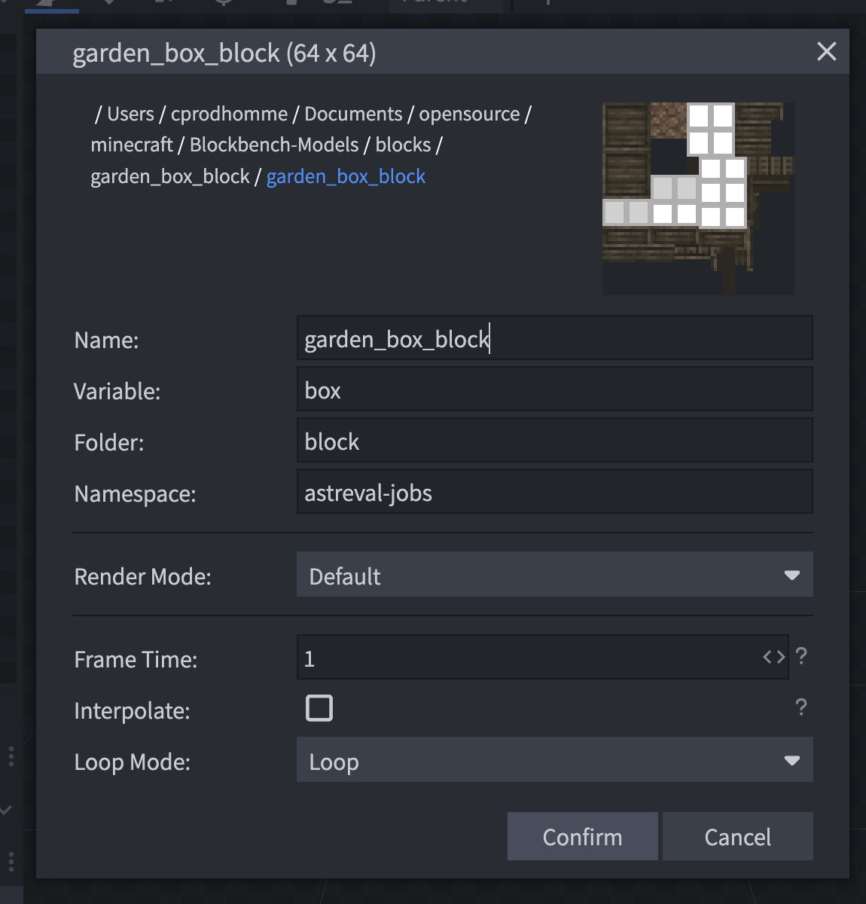
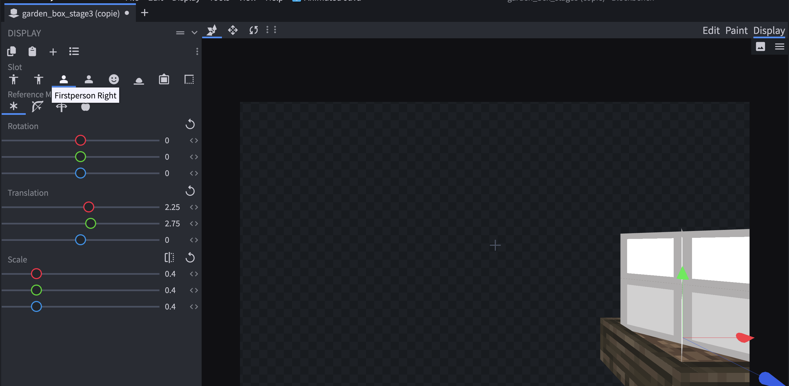

# Modéliser un objet 3D avec Blockbench

## 🎯 Intention

---

Apprendre à manipuler et exporter un model 3D avec le logiciel [Blockbench](https://www.blockbench.net/)

## ✅ Point clef

---

### Définir les propriétés des textures
    
    Pour éviter d’avoir à modifier le fichier JSON de notre model à chaque modification 
    
    Faites un clic droit sur votre texture, puis “properties”
    
    - Nom
    - Valeur par défaut
    
    

### Définir le "Display" de votre model (vue FPS, vue GUI, etc.)  
    
    Afin de s’assurer que le bloc ne soit affiché ni trop petit, ni trop grand dans le jeu
    
    
    

# 🧑‍🎓 Aller plus loin

---

- Voir le guide de Blockbench sur le style de Minecraft (qui est très complet !) : [https://www.blockbench.net/wiki/guides/minecraft-style-guide/](https://www.blockbench.net/wiki/guides/minecraft-style-guide/)
