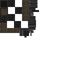

# Optimiser ses texture

## 🎯 Intention

---

Optimiser les textures dans Minecraft réduit la consommation de RAM (mémoire vive, utilisée pour gérer les processus en cours) et de VRAM (mémoire vidéo, dédiée aux graphismes). Des textures plus légères allègent ces ressources, améliorant ainsi les performances et la fluidité du jeu. Cela diminue les risques de ralentissements ou de crashs, pour une expérience stable et accessible sur diverses configurations.

## ✅ Points clés

---

### Réduire la taille de ses PNG avec [Optipng](https://optipng.sourceforge.net/)

Optipng permet de réduire grandement la taille des fichiers PNG **sans changer le moindre pixel de votre texture**. Il agit directement sur la suppression des data interne que contient votre fichier.

### Ajuster la taille du fichier

| ❌ BAD | ✅ GOOD |
|--------|---------|
|  ici l’image fait 128x128 | Ici l’image fait 78x75 après rognage. Note : on pourrait chercher à mieux optimiser en compactant les textures  |
|  |   |

### **Supprimer les Zones Inutilisées**

Pour les textures partiellement transparentes, assurez-vous que les zones sans pixels n’occupent pas d’espace inutile. Cela peut éviter une surcharge de mémoire lors du rendu.
