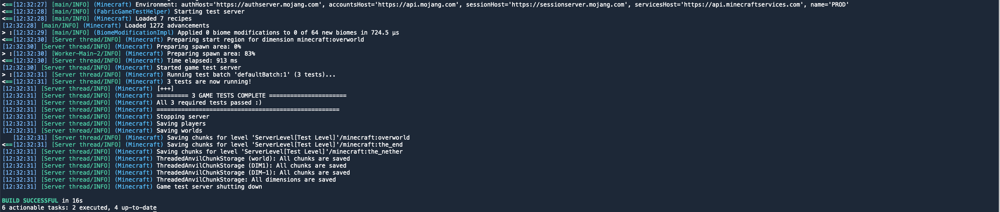
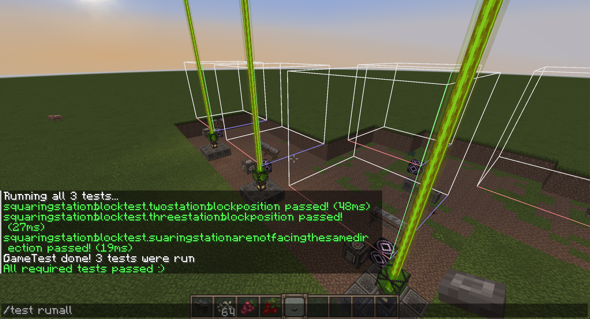

# Introduction à GameTest

## Présentation de GameTest

GameTest est un framework de test intégré à Minecraft qui permet de tester des fonctionnalités de jeu de manière automatisée. Il s'agit d'un outil puissant pour les tests end-to-end (e2e), qui vous permet de vérifier que votre mod fonctionne comme prévu dans un environnement de jeu réel.

## Principe des Tests End-to-End

Les tests end-to-end simulent des scénarios réels dans le jeu pour vérifier que toutes les fonctionnalités de votre mod fonctionnent correctement. Cela inclut l'interaction avec des blocs, des entités, et d'autres éléments du jeu.

## Lancer les tests dans le terminal
- Utilisez la commande suivante pour lancer tous les tests GameTest :
   ```sh
   ./gradlew runGameTest
   ```

   

## Lancer les tests via le Client Minecraft
- Lancez le client Minecraft en utilisant la commande suivante :
   ```sh
   ./gradlew runClient
   ```
- Ouvrez un monde et utilisez la commande suivante pour lancer tous les tests :
   ```sh
   /test runAll
   ```

   

## Conclusion

GameTest est un outil essentiel pour garantir la qualité et la stabilité de votre mod Minecraft. En utilisant ces méthodes, vous pouvez automatiser vos tests et vous assurer que votre mod fonctionne comme prévu dans un environnement de jeu réel.
