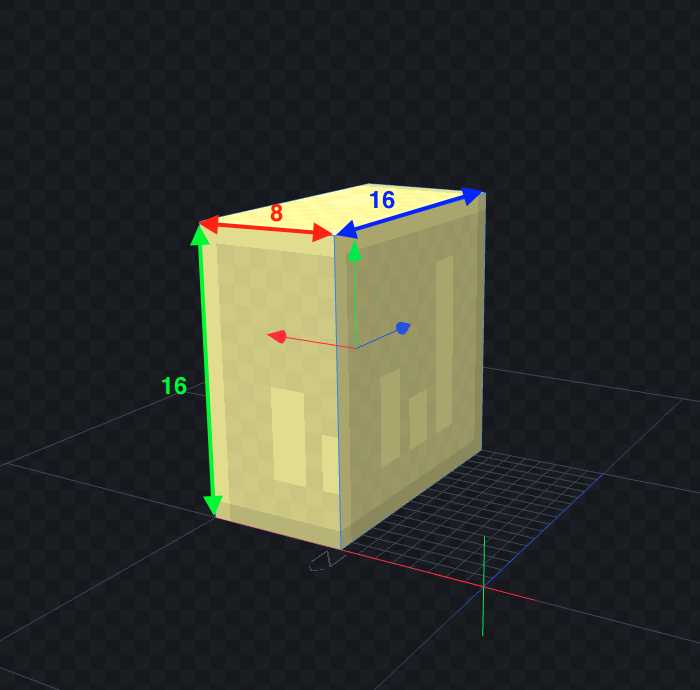
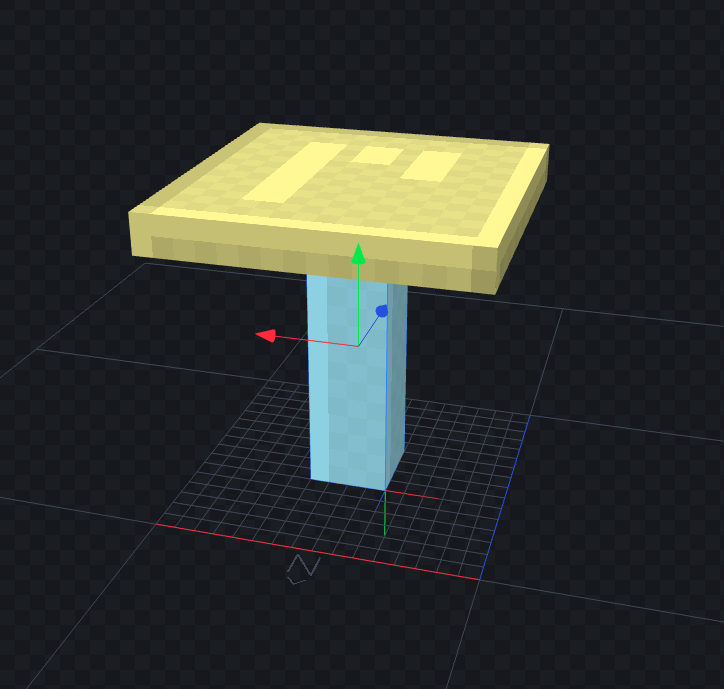
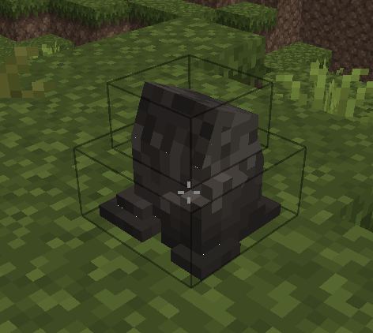
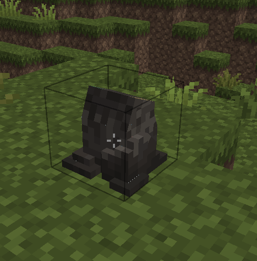

# Custom Shape

Dans Minecraft, les "shapes" (formes) définissent la forme d'un bloc. Par défaut, un bloc a une forme pleine de 16x16x16 pixels, mais il est possible de réduire cette forme ou de créer des shapes personnalisés pour mieux correspondre à des items plus petits ou plus complexes, comme une chaise.

## Créer un SHAPE custom



`Block.createCuboidShape(0, 0, 0, 8, 16, 16)`

```java
public class ExampleBlock extends Block {
    private static final VoxelShape SHAPE = Block.createCuboidShape(0, 0, 0, 8, 16, 16);

    @Override
    public VoxelShape getOutlineShape(BlockState state, BlockView view, BlockPos pos, ShapeContext context) {
        return SHAPE;
    }
}
```

## Créer un SHAPE custom pour une forme complexe



On a 2 blocs ici qui constitue notre Shape. On utilisera la méthode `VoxelShapes.union` en passant en paramètre de notre fonction les différents blocs.

```java
private static final VoxelShape SHAPE = VoxelShapes.union(
    Block.createCuboidShape(6, 0, 6, 10, 14, 10), // Pieds de table
    Block.createCuboidShape(0, 14, 0, 16, 16, 16)  // Surface de table
);

@Override
public VoxelShape getOutlineShape(BlockState state, BlockView view, BlockPos pos, ShapeContext context) {
    return SHAPE;
}
```

## Déterminer les collisions du blocs

Pour déterminer les collisions (c’est à dire, ce qui empêchera un joueur ou une flèche de traverser, il faut définir la méthode `getCollisionShape` dans votre classe

```java
@Override
public VoxelShape getCollisionShape(BlockState state, BlockView world, BlockPos pos, ShapeContext context) {
    return SHAPE;
}
```

Note : il est possible de ne pas utiliser le même Shape pour l’outline et les collisions : 

```java

private static final VoxelShape COLLISION_SHAPE = Block.createCuboidShape(0, 0, 0, 8, 16, 16);
private static final VoxelShape OUTLINE_SHAPE = Block.createCuboidShape(0, 0, 0, 8, 8, 8);

@Override
public VoxelShape getCollisionShape(BlockState state, BlockView world, BlockPos pos, ShapeContext context) {
    return COLLISION_SHAPE;
}

@Override
public VoxelShape getOutlineShape(BlockState state, BlockView view, BlockPos pos, ShapeContext context) {
    return OUTLINE_SHAPE;
}
```

## ❌ Erreurs type à éviter

---

Il est préférable d’avoir un shape carré plutôt que de chercher à suivre le model 3d

<aside>
❌ BAD



</aside>

<aside>
✅ GOOD



</aside>
