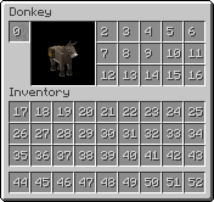
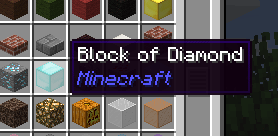

# Screens

Les screens sont les interfaces graphiques que vous voyez à l'écran lorsque vous interagissez avec certains blocs, entités ou objets dans Minecraft.

## Lexique

### Screen

Un `Screen` est l'interface utilisateur graphique (GUI) affichée à l'écran lorsque le joueur interagit avec certains blocs, entités ou objets. Par exemple, les fenêtres d'inventaire, de four, de coffre ou de table de craft sont toutes des `Screens`. Il hérite de la classe `HandledScreen<T>`, ce qui lui permet d'être associé à un `ScreenHandler` pour gérer la logique d'interaction entre le client (côté joueur) et le serveur. Le `Screen` est principalement responsable de l'affichage visuel et des interactions utilisateur (clics, entrées clavier, etc.).

### ScreenHandler

Un `ScreenHandler` gère la logique sous-jacente des interfaces utilisateur (`Screens`) côté serveur. Il fait le lien entre le client et le serveur, permettant de synchroniser les données (comme les inventaires, les recettes, etc.) entre les deux. Par exemple, il contrôle quels objets peuvent être placés dans quels emplacements (`Slots`), gère les transferts d'items, et applique des restrictions spécifiques. Le `ScreenHandler` assure également que les interactions avec la GUI (comme déplacer des items) sont correctement traitées côté serveur.

### Slot

Un `Slot` représente un emplacement dans un inventaire (`Container`), qu'il s'agisse de l'inventaire du joueur ou de celui d'un bloc spécifique (comme un coffre ou un four). Chaque `Slot` peut contenir un seul type d'item et a une capacité définie (habituellement une pile d'items). Il est utilisé dans un `ScreenHandler` pour déterminer les interactions autorisées, comme quels items peuvent être placés dans le `Slot`, les quantités maximales, et si le `Slot` est interactif (c.-à-d. s'il accepte des clics ou des glisser-déposer).
    
    
    
    Ici on voit les ID des différents slots (de 0 à 52)
    
### GhostSlot

Un `GhostSlot` est un type spécial de `Slot` qui n'accepte pas physiquement d'items mais affiche visuellement un item comme référence ou suggestion. Ce type de `Slot` est souvent utilisé dans des interfaces où l'utilisateur sélectionne un modèle ou un item pour configurer quelque chose (par exemple, une recette). L'interaction avec un `GhostSlot` ne modifie pas l'inventaire du joueur ; il ne sert que d'indicateur visuel.

### Tooltip

Un `Tooltip` est une fenêtre contextuelle qui s'affiche lorsque le joueur survole un item ou un composant dans un `Screen` avec sa souris. Il fournit des informations supplémentaires sur l'élément survolé, telles que le nom de l'item, sa description, des statistiques, des enchantements, ou des propriétés personnalisées définies par le mod. Les `Tooltips` sont définis par la méthode `appendTooltip()` et peuvent être personnalisés pour afficher des informations conditionnelles ou dynamiques en fonction de l'état du jeu ou de l'item.
    
    
    
    Ici le tooltip au survol du bloc de diamand
   